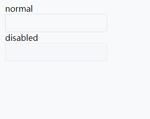
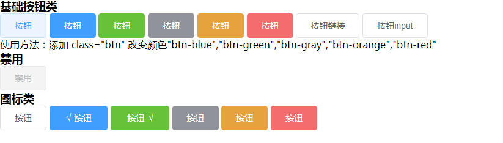
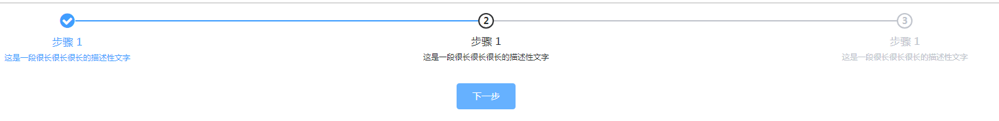

# RainierUI
#### 方便无前端框架直接使用的ui组件：
## 下方演示均为图片 详细代码可下载查看目测或者等我挂个地址~

#### 第一版包括：

## switch （选择）组件 ：

## checkbox （多选）组件 ：

## radio(单选) 组件 ：

## button(按钮)组件：

## rate（星级评分）组件：

## progress（进度条）组件：

## （滑块）组件：

## steps（步骤条）组件：

## 以及第一个动图（输入框）   哈哈哈哈哈
